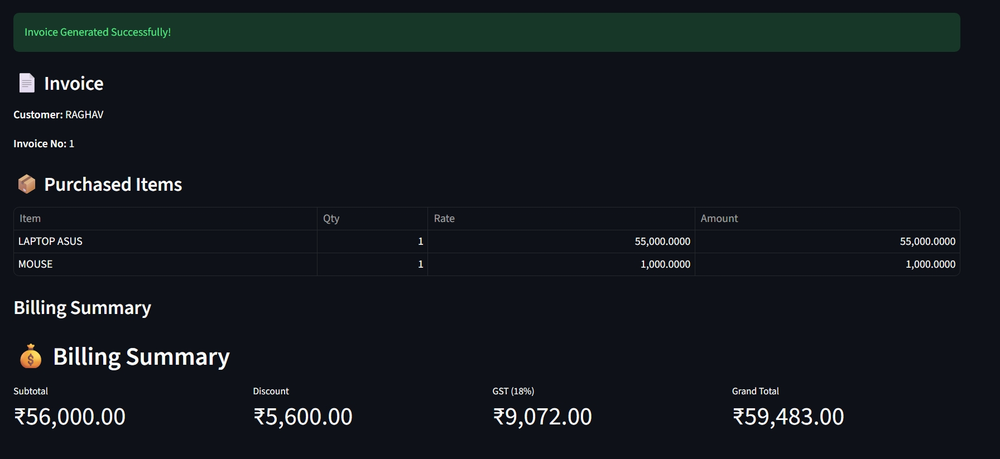

# 🧾 Smart Invoice Generator

A professional invoice generation system built using Python, Streamlit, and Pandas. The application allows users to create invoices, calculate GST, apply payment-based discounts, and generate a detailed billing summary through an interactive web interface.

## 🌐 Live Demo

https://raghavinvoice-kvnq9wg9k2xfl4awtavik4.streamlit.app/

## ✨ Features

* Customer information management
* Multiple product entry support
* Automatic invoice generation
* GST (18%) calculation
* Payment method discounts

  * UPI: 10%
  * Card: 7%
  * Cash: 3%
* Carry bag charges option
* Professional billing summary
* Interactive Streamlit dashboard
* Responsive and user-friendly interface

## 🛠️ Technologies Used

* Python
* Streamlit
* Pandas

## 📸 Screenshot



## 📂 Project Structure

```text
Smart-Invoice-Generator/
│
├── app.py
├── requirements.txt
├── README.md
└── dashboard.png
```

## 🚀 Installation

Clone the repository:

```bash
git clone https://github.com/raghavguglani21/Raghav.invoice.git
```

Move into the project folder:

```bash
cd Raghav.invoice
```

Install dependencies:

```bash
pip install -r requirements.txt
```

Run the application:

```bash
streamlit run app.py
```

## 📊 Billing Features

* Subtotal Calculation
* Discount Calculation
* GST Calculation
* Carry Bag Charges
* Grand Total Generation

## 🎯 Purpose

This project was developed to demonstrate Python programming, data handling, billing system logic, and web application development using Streamlit.

## 👨‍💻 Author

Raghav Guglani

## 📜 License

This project is intended for educational and learning purposes.
